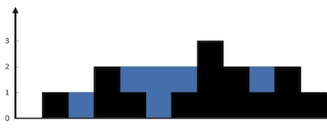

042. Trapping Rain Water

  

上面是由数组 [0,1,0,2,1,0,1,3,2,1,2,1] 表示的高度图，在这种情况下，可以接 6 个单位的雨水（蓝色部分表示雨水）。 感谢 Marcos 贡献此图。

示例:

输入: [0,1,0,2,1,0,1,3,2,1,2,1]

输出: 6

my_own:
第一次做的时候思路是从底部开始注水，需要找到数组中的最大值，从最小值开始，遍历每一层，在每一层中又需要找到大于该层的数，因此在每层都需要遍历整个数据，时间超出限制！
实际上，确定每个位置上的水的容量与该位置左右的数据最大值有关，具体就是： 在一个位置能容下的雨水量等于它左右两边柱子最大高度的最小值减去它的高度。

solution:

1.动态编程
在暴力方法中，我们仅仅为了找到最大值每次都要向左和向右扫描一次。但是我们可以提前存储这个值。因此，可以通过动态编程解决。

算法

找到数组中从下标 i 到最左端最高的条形块高度 left_max

找到数组中从下标 i 到最右端最高的条形块高度 right_max 

扫描数组 height 并更新答案：

    累加 min(max_left[i],max_right[i])−height[i] 到 ans 上

```cpp
int trap(vector<int>& height)  
{  
    if(height == null)  
		return 0;  
    int ans = 0;  
    int size = height.size();  
    vector<int> left_max(size), right_max(size);  
    left_max[0] = height[0];  
    for (int i = 1; i < size; i++) {  
        left_max[i] = max(height[i], left_max[i - 1]);  
    }  
    right_max[size - 1] = height[size - 1];  
    for (int i = size - 2; i >= 0; i--) {  
        right_max[i] = max(height[i], right_max[i + 1]);  
    }  
    for (int i = 1; i < size - 1; i++) {  
        ans += min(left_max[i], right_max[i]) - height[i];  
    }  
    return ans;  
}  

复杂性分析

时间复杂度：O(n)。  
存储最大高度数组，需要两次遍历，每次 O(n)。  
最终使用存储的数据更新\text{ans}ans ,O(n)。  
空间复杂度：O(n) 额外空间。


Quote:
https://leetcode-cn.com/problems/trapping-rain-water/solution/jie-yu-shui-by-leetcode/