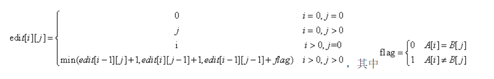

72. Edit Distance

给定两个单词 word1 和 word2，计算出将 word1 转换成 word2 所使用的最少操作数 。

你可以对一个单词进行如下三种操作：

插入一个字符

删除一个字符

替换一个字符

示例 1:
输入: word1 = "horse", word2 = "ros"

输出: 3
解释: 
horse -> rorse (将 'h' 替换为 'r')
rorse -> rose (删除 'r')
rose -> ros (删除 'e')

示例 2:  
输入: word1 = "intention", word2 = "execution"

输出: 5  
解释:  
intention -> inention (删除 't')  
inention -> enention (将 'i' 替换为 'e')  
enention -> exention (将 'n' 替换为 'x')  
exention -> exection (将 'n' 替换为 'c')  
exection -> execution (插入 'u')  

### my_own:

算法思路  
一般情况，可以把问题看作用最少步骤将 str1[1…i] 转化为 str2[1…j]。  
若要str1[1…i] 转化为 str2[1…j]步骤最少，则需满足下面三种情况之一：  
   1、str1[1…i-1] 转化为 str2[1…j] 的步骤最少，记总操作数为k。  
   2、str1[1…i] 转化为 str2[1…j-1] 的步骤最少，记总操作数为m。  
   3、str1[1…i-1] 转化为 str2[1…j-1] 的步骤最少，记总操作数为n。  
若满足情况1，还需执行一步操作，删除str1[i]，所以总最少操作数为 k+1,  
若满足情况2，还需执行一步操作，在str1后插入str2[j]，所以总最少操作数为 m+1,  
若满足情况3，还需要分两种情况：  d
- str1[i] == str2[j]，两个字符串最后一个字符相等，则不需要进行操作，总最少操作数为 n
- str1[i] != str2[j]，两个字符串最后一个字符不等，需要用str2[j]替换str1[i]，总最少操作数为 n+1
最后取 k+1，m+1，n/n+1中最小值即为编辑距离。

PS:  
#### 建立动态规划方程   
  用edit[i][j]表示A串和B串的编辑距离。edit[i][j]表示A串从第0个字符开始到第i个字符和B串从第0个字符开始到第j个字符，这两个字串的编辑距离。字符串的下标从1开始。

  dis[0][0]表示word1和word2都为空的时候，此时他们的Edit Distance为0。很明显可以得出的，dis[0][j]就是word1为空，word2长度为j的情况，此时他们的Edit Distance为j，也就是从空，添加j个字符转换成word2的最小Edit Distance为j；同理dis[i][0]就是，word1长度为i，word2为空时，word1需要删除i个字符才能转换成空，所以转换成word2的最小Edit Distance为i。  
    
  
QUOTE:https://blog.csdn.net/baodream/article/details/80417695

上式中的min（）函数中的三个部分，对应三种字符操作方式：

edit[i-1][j]+1相当于给word2的最后插入了word1的最后的字符，插入操作使得edit+1，之后计算edit[i-1][j]；

edit[i][j-1]+1相当于将word2的最后字符删除，删除操作edit+1，之后计算edit[i][j-1];

edit[i-1][j-1]+flag相当于通过将word2的最后一个字符替换为word1的最后一个字符。flag标记替换的有效次数。


### solution(from pezy):  

此题乍看之下有点摸不着头脑，但其实属一道非常经典的题目。

有兴趣的童鞋可以看看这个 [Stanford 的 Minimum Edit Distance](http://www.stanford.edu/class/cs124/lec/med.pdf)

-----

而这道小题，只是上述大论题中最简单的情况：连 Replace 操作也仅算一步，各操作都被一视同仁。

我们从实际例子开始分析，看以下几组单词：

```
graffe
graf
    ^^
    insert(2)

graffe
graft
    ^^
    replace + insert

graffe
grail
   ^^^
   replace(2) + insert

graffe
giraffe
 ^
 delete
```

上述就是咱们人脑推断出来的过程，看起来比较直接，一眼就分辨出来了。但如何用代码来表述这个过程，却是一个难题。假设第一个单词为 word1, 长度为 n; 第二个单词为 word2, 长度为 m.

直接去比较 n 与 m 长度的字符串显然无从下手，那么我们简化问题，首先考虑 0 长度，若 m == 0, 则显然应该返回 n， 反之亦然。

```cpp
if (m == 0) return n;
if (n == 0) return m;
```

假设 word1 的当前 pos 为 i, word2 的当前 pos 为 j，上述情况就是 i=n 以及 j=m 的时候。如果我们用 distance(i, j) 来表示问题的解，那么最终要求的，便是 distance(n, m).

然后回到上述实例，前三组都有一个特点，就是前缀相同：

    gra
    gra

请问，相同的前缀 `gra` 对咱们的结果有影响吗？如果都是 `g` 呢？如果都是 `gr` 呢？是的，都一样，最终的 distance 是一样的， 故有:

    if (word1[i] == word2[j]) distance(i, j) = distance(i-1, j-1);  // [定理1]

那就要问了，若 `word1[i] != word2[j]` 呢？如第三组：

    |graf  ==  |f
    |grai      |i
           ^
        根据[定理1]

显然，简化后仅需要一个 replace 操作，故应为 `gra` 的情况下 +1，即

    else A[i][j] = distance(i-1, j-1) + 1;
                                        ^
                              // 这里加的数取决于 replace 操作需要消耗的 distance

难道规律已然被我们找到？但为何仅仅用到了 replace 操作呢？用 insert 和 delete 不行吗？再看第一组：

    |graffe  ==  |fe  ==  distance(i, j)
    |graf        |
            ^
         根据[定理1]

简化后的结果，我们很容易看出 word2 需要 insert 两次。如果将 i 倒退一步， 可以发现：

    distance(i, j) == distance(i-1, j) + |e == distance(i-1, j) + 1; // [定理2]
                                         |
                                                                  ^
                                                         // 这里加的数取决于 insert 操作需要消耗的 distance

同理咱们分析第四组：

    |graffe   ==  |g   == distance(i, j)
    |giraffe      |gi
              ^
           根据[定理1]

简化后的结果，我们也能较容易看出 word2 需要 delete 一次。但如果将 j 倒退一步，可以发现：

    distance(i, j) == distance(i, j-1) + |   ==  distance(i, j-1) + 1; // [定理3]
                                         |i
                                                                    ^
                                                          // 这里加的数取决于 delete 操作需要消耗的 distance

到此为止，我们发现存在三种方式，将 distance 消灭为0，可以总结如下：

                                               __ true :  distance(i-1, j-1)  // [定理1]
                      |_ word1[i] ?= word2[j] |
    distance(i, j) == |                       |__ false : distance(i-1, j-1) + op(replace)
                      |_ distance(i-1, j) + op(insert) // [定理2]
                      |_ distance(i, j-1) + op(delete) // [定理3]

我们要求的是最小的 distance ，那么根据上述公式，我们所求的不过是这三种情况的最小值。在这道题里:

    op(replace) == op(insert) == op(delete) == 1

最后，我们发现想要表述 distance(i, j)，需依赖一个 n*m 的矩阵，将每一次子串比较的结果保存下来。

这种通过"矩阵"的方式，来积累每一次子问题结果的手段，是非常非常明显的** DP (动态规划问题) ** 。 想一想 [29. Unique Paths](../29. Unique Paths)，再想想杨辉三角，就会发现其本质完全一致。

由于 DP 问题，十分依赖上一次的结果，而对于 n*m 的解空间矩阵来说，首行与首列，是无法通过 DP 手段计算出的，若仍想要依赖 DP。我们需要在外面手工包一层。即让整个解空间矩阵(n*m)都有上一次的结果可依。

那么就成了一个 `(n+1) * (m+1)` 的矩阵了。

对于首行，即 i 不变， j 递增，即：

    |
    |gggg ...

显然属于[定理3]的范畴，可知第一行为：{0, 1, 2, 3 ...}

同理，对于首列，即 j 不变， i 递增，即：

    |gggg ...
    |

显然属于[定理2]的范畴，可知第一列为：{0, 1, 2, 3 ...}

最终矩阵的外壳，看起来就是：

     _              _
    |0 1 2 3 4 5 ... |
    |1
    |2
    |3
    |4
    |5
    |.
    |.
    |_              _ |

而我们需要做的，便是填充这个矩阵，问题的最终解是该矩阵右下角的值：`A[n][m]`.
