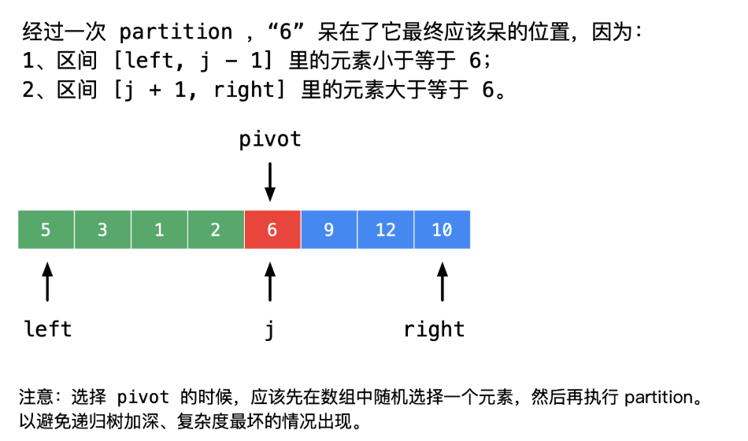

215. Kth Largest Element in an Array

在未排序的数组中找到第 k 个最大的元素。请注意，你需要找的是数组排序后的第 k 个最大的元素，而不是第 k 个不同的元素。

```
示例 1:

输入: [3,2,1,5,6,4] 和 k = 2
输出: 5
```
```
示例 2:

输入: [3,2,3,1,2,4,5,5,6] 和 k = 4
输出: 4
```


### solution:

方法二：借助 partition 操作定位到最终排定以后索引为 len - k 的那个元素（特别注意：随机化切分元素）
以下是注意事项，因为很重要，所以放在前面说：
```
快速排序虽然快，但是如果实现得不好，在遇到特殊测试用例的时候，时间复杂度会变得很高。如果你使用 partition 的方法完成这道题，时间排名不太理想，可以考虑一下是什么问题，这个问题很常见。
```
以下的描述基于 “快速排序” 算法知识的学习，如果忘记的朋友们可以翻一翻自己的《数据结构与算法》教材，复习一下，partition 过程、分治思想和 “快速排序” 算法的优化。

分析：我们在学习 “快速排序” 的时候，接触的第 1 个操作就是 partition（切分），简单介绍如下：

partition（切分）操作，使得：
```
对于某个索引 j，nums[j] 已经排定，即 nums[j] 经过 partition（切分）操作以后会放置在它 “最终应该放置的地方”；
- nums[left] 到 nums[j - 1] 中的所有元素都不大于 nums[j]；
-nums[j + 1] 到 nums[right] 中的所有元素都不小于 nums[j]。
```


partition（切分）操作总能排定一个元素，还能够知道这个元素它最终所在的位置，  
这样每经过一次 partition（切分）操作就能缩小搜索的范围，这样的思想叫做 “减而治之”（是 “分而治之” 思想的特例）。

